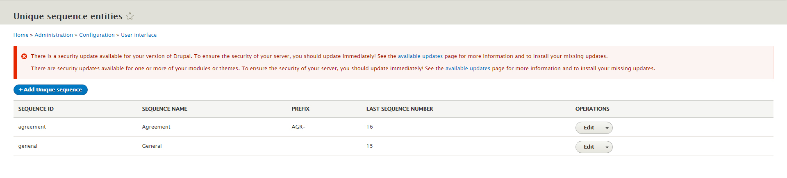

# Unigen
Generate unique sequence number

This is a Drupal 8 module. This a small and handy module to generate Unique number with/without prefix. There are lot of places where you need to generate unique numbers with a custom starting point and with/without a prefix. Like Agreement number, Certificate number, Purchase order number, Order Number, Customer Number etc. You can start a customer number from 10000 with aprefix like "C-", so your customer number will be "C-10000". This module can help you out.

This module provides three options to generate the sequence number:
1. A Drupal service
2. A Field type
3. Rest API

# Installation
Install the module using Drupal standard procedure

---------------------------------------------------------------
You can contact me at: <strong>Shafiq Hossain</strong>, <em>md.shafiq.hossain@gmail.com</em>
